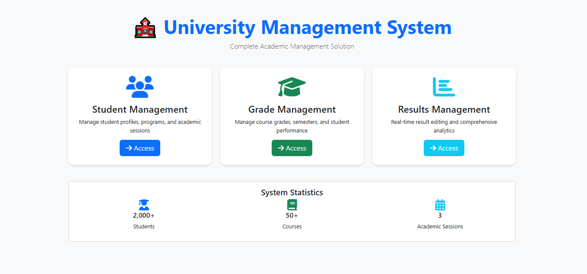
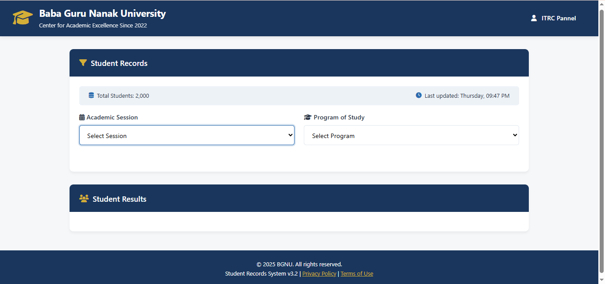
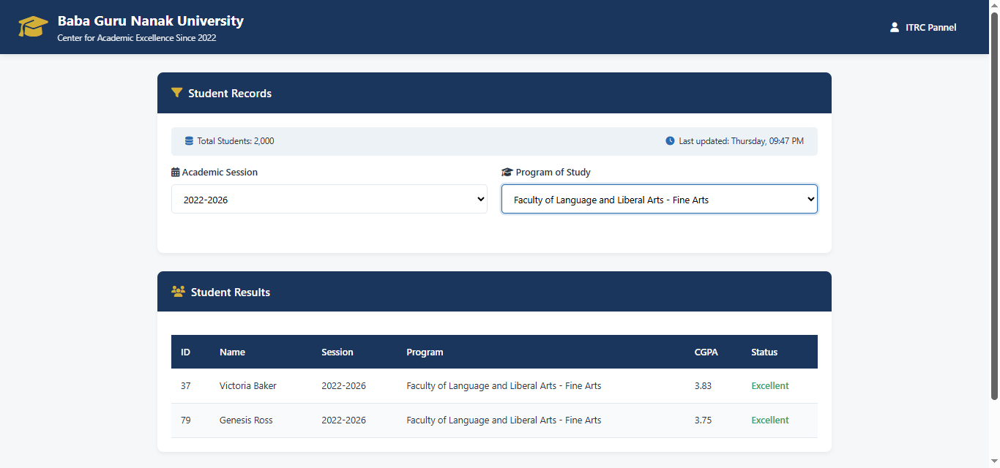
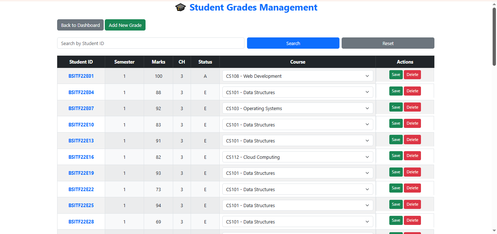
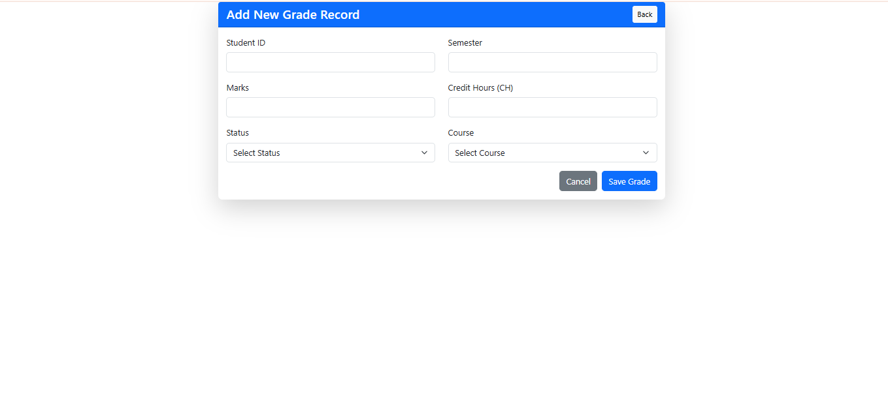
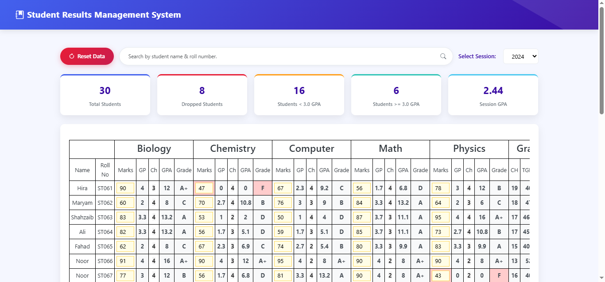

# 🏫 Complete University Management System

A comprehensive, modern, and feature-rich **University Management System** built with Laravel that seamlessly integrates student records, grade management, and results processing into a single powerful platform.

---

## 🌟 Live Demo  
[🚀 View Live Application](https://university.naeemhub.com)

---

## 📸 Screenshots  

### 🖥️ Dashboard  

### 👨‍🎓 Student Management  
  

### 📊 Grade Management  
  

### 📈 Results Analytics  

---

## 🎯 Why This Project Stands Out?  

This isn't just another student management system - it's a **complete academic ecosystem** that demonstrates:  
- ✅ **Real-time data processing** with live editing capabilities  
- ✅ **Professional UI/UX** with responsive design  
- ✅ **Advanced analytics** and statistical reporting  
- ✅ **Scalable architecture** with optimized database design  
- ✅ **Enterprise-grade features** found in commercial systems  

---

## 🏆 Key Features  

### 📋 Student Management Module  
- Complete student profiles with personal and academic information  
- Program & Department Management with faculty-wise organization  
- Academic session tracking across multiple years  
- Advanced filtering system by session, program, and student status  
- Automated status classification (Excellent, Good, Probation) based on CGPA  

### 📊 Grade Management Module  
- Semester-wise grade tracking with credit hour system  
- Course catalog with code & title  
- Inline editing with real-time updates  
- Bulk operations for efficient data management  
- Data validation with comprehensive error handling  

### 📈 Results Management Module  
- Live result editing with instant grade calculation  
- Automatic GPA/CGPA computation  
- Statistical analytics with session-wise performance reports  
- Multi-session support for historical data analysis  
- Data integrity protection with master backup system  

---

## 🎨 User Experience Excellence  
- Responsive design (desktop, tablet, mobile)  
- Modern dashboard with intuitive navigation  
- Real-time feedback with animated notifications  
- Professional UI with university-themed design  
- Accessibility features for inclusive usage  

---

## 🛠️ Technology Stack  

| Layer | Technology | Purpose |
|-------|------------|---------|
| **Backend** | Laravel 12 | Robust PHP framework with MVC architecture |
| **Frontend** | Bootstrap 5 | Responsive and modern UI components |
| **Database** | MySQL 8.x | Relational database with optimized queries |
| **JavaScript** | jQuery 3.x | AJAX operations and DOM manipulation |
| **Styling** | Custom CSS | Professional design with animations |
| **Icons** | Font Awesome | Professional iconography |

---

## 📊 System Architecture  

